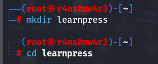

# CVE

Chọn phiên bản LearnPress 4.1.7.3.2

1 container mysql

1 container wordpress 

Tạo file docker-compose.yml:

`version: '3.8'`

`services:
db:
image: mysql:5.7
container_name: lp_db
restart: always
environment:
MYSQL_ROOT_PASSWORD: rootpass
MYSQL_DATABASE: wordpress
MYSQL_USER: wpuser
MYSQL_PASSWORD: wppass
volumes:
- db_data:/var/lib/mysql`

`wordpress:
image: wordpress:latest
container_name: lp_wp
depends_on:
- db
restart: always
ports:
- "8080:80"
environment:
WORDPRESS_DB_HOST: db:3306
WORDPRESS_DB_USER: wpuser
WORDPRESS_DB_PASSWORD: wppass
WORDPRESS_DB_NAME: wordpress
volumes:
- wp_data:/var/www/html`

`volumes:
db_data:
wp_data:`

---

- `db` dùng **mysql:5.7** – bản này thường được dùng chung với WordPress trong các template chính thức. [Docker Hub+2Stack Overflow+2](https://hub.docker.com/_/mysql?utm_source=chatgpt.com)
- `wordpress` dùng **wordpress:latest** (image official). [Docker Hub](https://hub.docker.com/_/wordpress?utm_source=chatgpt.com)
- Port `8081` trên host map vào `80` trong container → bạn truy cập tại `http://localhost:8081`.

Vào Plugin LearnPress, chọn Advanced View —>Chọn phiên bản 4.1.7.3.2:

Tại [http://localhost:8081/wp-admin/](http://localhost:8081/wp-admin/), chọn Plugin trong bảng menu bên trái —> Nhấn thêm mới

—> Tải file zip của plugin lên

Gặp lỗi:

Check tiến trình docker đang chạy:

Vào shell của nó `“docker exec -it lp_wp bash”`:

`mkdir -p /usr/local/etc/php/conf.d`

`cat > /usr/local/etc/php/conf.d/uploads.ini << 'EOF'
file_uploads = On
memory_limit = 256M
upload_max_filesize = 64M
post_max_size = 64M
max_execution_time = 300
EOF`

—> kiểm tra lại thông tin `“docker exec -it lp_wp bash -c 'php -i | grep -E "upload_max_filesize|post_max_size"`

Restart lại container:

Restart trang:

Thêm các thông tin về Tên khóa học và mô tả —> Nhấn “xuất bản”

Đăng nhập vào MySQL sử dụng tài khoản root với mật khẩu “rootpass”

—> Use wordpress

